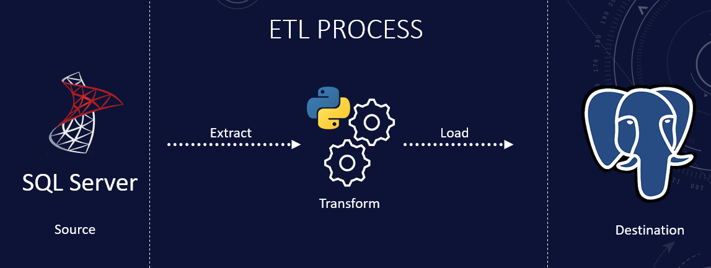

# **DataHarmonize: Machine Learning ETL Pipeline**
**Screenshot:**

**Introduction:**

DataHarmonize is an ETL (Extract, Transform, Load) pipeline designed for machine learning. It streamlines data integration, transformation, and loading tasks, making it easy to prepare data for your ML projects.

**Components:**

1. **combine_data.py**: Combine two datasets using this script.

2. **csv_to_sql.py**: Insert the combined data into SQL Server.

3. **utils.py**: Contains transformation functions for data preprocessing.

4. **etl.py**: Extract data from SQL Server, apply transformations, and load it into PostgreSQL.

**Getting Started:**

1. Clone this repo.
2. Install dependencies with `pip install -r requirements.txt`.
3. Customize transformations in `utils.py`.
4. Run the ETL script using `python etl.py`.

**Dataset**
You can find the dataset at this link: https://archive.ics.uci.edu/dataset/320/student+performance
